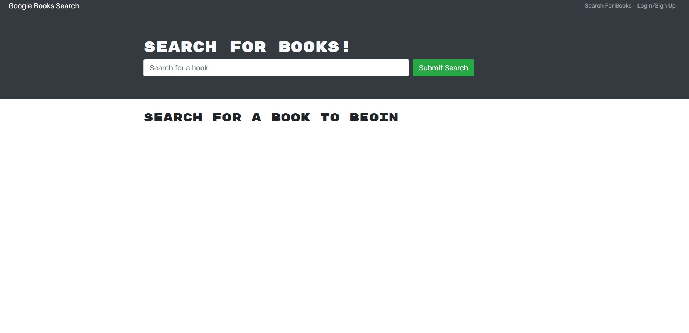
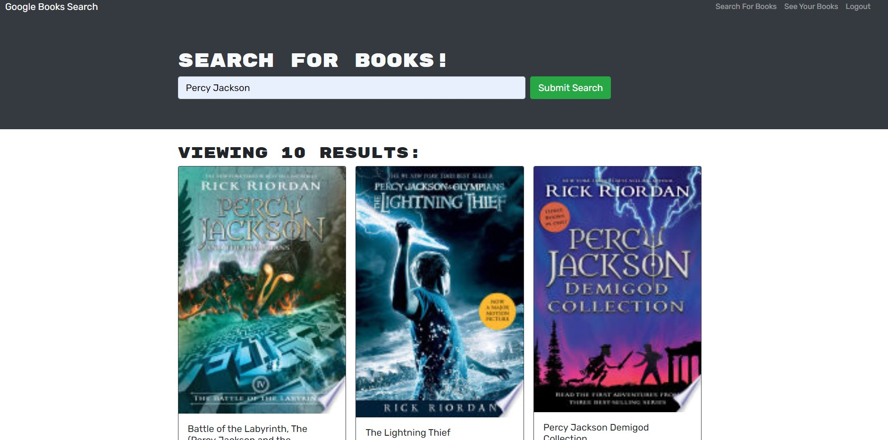
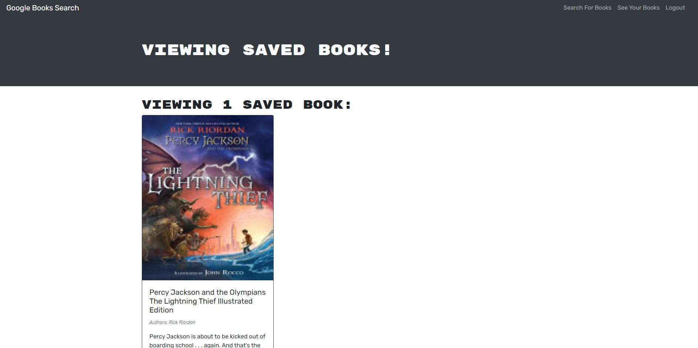

# MooPlayer

  ## Table of Contents

  * [Acceptance Criteria](#acceptance-criteria)
  * [Installation](#installation)
  * [Links](#links)  
  * [Usage](#usage)
  * [Technologies](#technologies)
  * [API](#api)
  * [Repo Data](#repo)

## Acceptance Criteria

GIVEN a book search engine
WHEN I load the search engine
THEN I am presented with a menu with the options Search for Books and Login/Signup and an input field to search for books and a submit button
WHEN I click on the Search for Books menu option
THEN I am presented with an input field to search for books and a submit button
WHEN I am not logged in and enter a search term in the input field and click the submit button
THEN I am presented with several search results, each featuring a book’s title, author, description, image, and a link to that book on the Google Books site
WHEN I click on the Login/Signup menu option
THEN a modal appears on the screen with a toggle between the option to log in or sign up
WHEN the toggle is set to Signup
THEN I am presented with three inputs for a username, an email address, and a password, and a signup button
WHEN the toggle is set to Login
THEN I am presented with two inputs for an email address and a password and login button
WHEN I enter a valid email address and create a password and click on the signup button
THEN my user account is created and I am logged in to the site
WHEN I enter my account’s email address and password and click on the login button
THEN I the modal closes and I am logged in to the site
WHEN I am logged in to the site
THEN the menu options change to Search for Books, an option to see my saved books, and Logout
WHEN I am logged in and enter a search term in the input field and click the submit button
THEN I am presented with several search results, each featuring a book’s title, author, description, image, and a link to that book on the Google Books site and a button to save a book to my account
WHEN I click on the Save button on a book
THEN that book’s information is saved to my account
WHEN I click on the option to see my saved books
THEN I am presented with all of the books I have saved to my account, each featuring the book’s title, author, description, image, and a link to that book on the Google Books site and a button to remove a book from my account
WHEN I click on the Remove button on a book
THEN that book is deleted from my saved books list
WHEN I click on the Logout button
THEN I am logged out of the site and presented with a menu with the options Search for Books and Login/Signup and an input field to search for books and a submit button


## Acceptance Criteria
To install the necessary dependencies, run the following command:

```
npm i
```

in the package.json file for the root folder, the client folder, and the server folder.

### Running the application

Use the command npm run watch in the server folder and npm start in the client folder!


## Links



	[Deployed Application](https://renbryant.github.io/MooPlayer/)


## Usage
In this app the use is able to sing up and log in to their own specific credentials. Their password is hashed using bcrypt and JWT, so no need to worry about security. Then the user is able to search for whatever book they want using our search bar that grabs information from the API. The user is able to save books that they like to their profile, and then also delete them when they view their profile. And of course the user is also able to log out of their account, and then log back in whenever they want.


## Technologies
The front end of this application:

```
react
apollo client
jwt-decode
graphql
bootstrap
```

The back end of this application:

```
mongoose
express
bcrypt
apollo-server-express
jwt
nodemon
graphql
```


## API
This project uses the Google Books API search engine built with a RESTful API, and refactors it to be a GraphQL API built with an Apollo Server.
[Link to Google Books API website](https://developers.google.com/books)


## Repo Data
This repo was contributed by RenBryant. I am a computer science student, a full-time worker, and a coding enthusiast! I love learning new things about computers and how they work and enjoy working on projects. Here is my GitHub Profile! [RenBryant](https://github.com/RenBryant). Thank you for checking out this project!